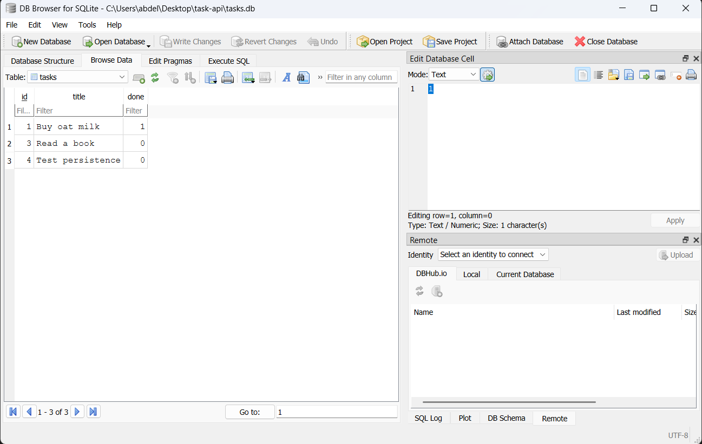

# Task API

A small CRUD API for managing a to-do list, built with FastAPI as part of the FlyRank Backend Track (Weeks 2–3). It supports creating, reading, updating, and deleting tasks. Data is stored in a SQLite database (tasks.db), so tasks survive a server restart.
## Requirements

- Python 3.10 or newer

## Install & run

```bash
# 1. create and activate a virtual environment
python -m venv .venv
.venv\Scripts\Activate.ps1        # Windows (PowerShell)
# source .venv/bin/activate       # Mac / Linux

# 2. install dependencies
pip install "fastapi[standard]"

# 3. start the server
fastapi dev main.py
```

The server runs at **http://localhost:8000**.
Interactive API docs (Swagger UI) are at **http://localhost:8000/docs**.

## Endpoints

| Method | Path          | Description     | Status codes        |
|--------|---------------|-----------------|---------------------|
| GET    | `/`           | API info        | 200                 |
| GET    | `/health`     | Health check    | 200                 |
| GET    | `/tasks`      | List all tasks  | 200                 |
| GET    | `/tasks/{id}` | Get one task    | 200, 404            |
| POST   | `/tasks`      | Create a task   | 201, 400            |
| PUT    | `/tasks/{id}` | Update a task   | 200, 400, 404       |
| DELETE | `/tasks/{id}` | Delete a task   | 204, 404            |

A task looks like this:

```json
{ "id": 1, "title": "Learn HTTP", "done": true }
```

Errors return a JSON body of the form `{ "error": "..." }`.

## Example request

Deleting a task that doesn't exist returns a `404` with a JSON error body:

```
$ curl -i -X DELETE http://localhost:8000/tasks/99
HTTP/1.1 404 Not Found
date: Sun, 19 Jul 2026 16:22:40 GMT
server: uvicorn
content-length: 29
content-type: application/json

{"error":"Task 99 not found"}
```

## Swagger UI


## Design notes

- **Errors use `{ "error": ... }`.** I used `JSONResponse` to build error
  responses by hand rather than FastAPI's `HTTPException`, because
  `HTTPException` always wraps messages in `{ "detail": ... }` and the
  assignment requires the `error` key.

- **POST and PUT read the raw request body** (via `Request`) instead of a
  Pydantic model. This was a deliberate trade: a Pydantic model rejects a
  malformed body with `422`, but the assignment requires `400`, so I parse
  and validate the body myself to control the status code. One side effect
  is that Swagger's "Try it out" shows input boxes for the GET endpoints but
  not for POST/PUT. Those two endpoints are fully tested with `curl` — see
  the example above — and work correctly for the whole create/update cycle.

- **Storage moved from memory to SQLite (Week 3).** In Week 2, tasks lived in a
  Python list and vanished whenever the server stopped; restarting brought back
  only the three seed tasks. That limitation is what Week 3 fixed. The
  endpoints, status codes, and request/response shapes are all unchanged — only
  the code behind them changed, from list operations to SQL queries. The
  endpoint table above needed no edits, which is the clearest evidence that
  storage is an implementation detail the client never sees.

## Database

Tasks are stored in a SQLite database file, `tasks.db`, in the project root.

**Why SQLite:** no server, no installation, no configuration — the whole
database is a single file, created automatically on first run. Python's
`sqlite3` module is built in, so there is nothing to install. Unlike the
in-memory list it replaced, the data survives restarts.

**Setup is automatic.** On startup the app creates `tasks.db` and the `tasks`
table if missing, and seeds three example tasks only when the table is empty,
so restarting never duplicates them. `tasks.db` is git-ignored, so a fresh
clone builds its own database — no manual setup.

All queries use parameterized placeholders (`?`), so user input is never
interpreted as SQL.

### Example query

Run by hand in DB Browser for SQLite:

    SELECT COUNT(*) FROM tasks;

Returned 3 — the number of rows in the table after a fresh start.



