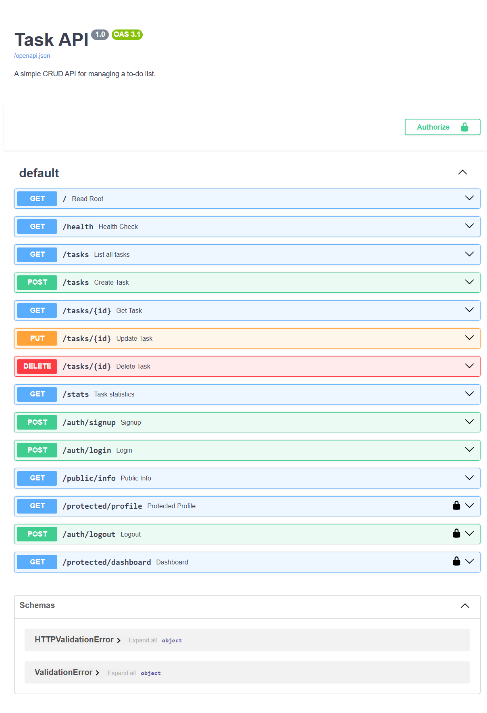
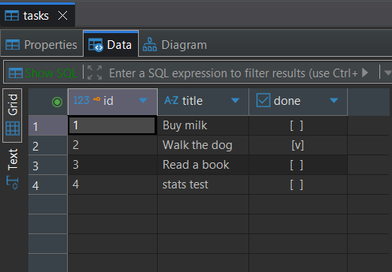

# Task API

A small CRUD API for managing a to-do list, built with FastAPI and backed by a PostgreSQL database running in Docker. It supports creating, reading, updating, and deleting tasks. The entire stack — the API and its database — starts with a single command.

## Requirements

Docker Desktop (or any Docker Engine with Compose). Nothing else — no local Python, database, or dependencies to install; everything runs in containers.

## Running it

```bash
# 1. copy the example environment file
cp .env.example .env

# 2. start the whole stack (API + database)
docker compose up
```

The API runs at <http://localhost:8000>. Interactive API docs (Swagger UI) are at <http://localhost:8000/docs>.

On first start the database initializes, the `tasks` table is created automatically, and three example tasks are seeded. The API waits for the database to be ready before starting, so `docker compose up` works on a clean clone with no manual setup.

## Configuration

Configuration lives in a `.env` file, which is git-ignored and never committed. A template with placeholder values is provided as `.env.example` — copy it to `.env` before running.

| Variable       | Description                                                |
|----------------|------------------------------------------------------------|
| `DATABASE_URL` | PostgreSQL connection string                               |
| `SUPABASE_URL` | URL of the Supabase project                                |
| `SUPABASE_KEY` | Supabase anon (public) key, **not** the `service_role` key |

The database password is kept out of the code and out of version control.

## Endpoints

| Method   | Path                    | Description              | Status codes  | Auth   |
|----------|-------------------------|--------------------------|---------------|--------|
| `GET` | `/` | API info | 200 | None |
| `GET` | `/health` | Health check | 200 | None |
| `GET` | `/tasks` | List all tasks | 200 | None |
| `GET` | `/tasks/{id}` | Get one task | 200, 404 | None |
| `POST` | `/tasks` | Create a task | 201, 400 | None |
| `PUT` | `/tasks/{id}` | Update a task | 200, 400, 404 | None |
| `DELETE` | `/tasks/{id}` | Delete a task | 204, 404 | None |
| `GET` | `/stats` | Task counts | 200 | None |
| `POST` | `/auth/signup` | Create a user account | 201, 400 | None |
| `POST` | `/auth/login` | Log in a user | 200, 400, 401 | None |
| `POST` | `/auth/logout` | Log out the current user | 204, 401 | Bearer |
| `GET` | `/protected/profile` | Get current user profile | 200, 401 | Bearer |
| `GET` | `/protected/dashboard` | Protected dashboard | 200, 401 | Bearer |

A task looks like this:

```json
{ "id": 1, "title": "Learn HTTP", "done": true }
```

Errors return a JSON body of the form `{ "error": "..." }`.

### Example request

Deleting a task that doesn't exist returns a 404 with a JSON error body:

```console
$ curl -i -X DELETE http://localhost:8000/tasks/99
HTTP/1.1 404 Not Found
date: Sun, 27 Jul 2026 05:31:23 GMT
server: uvicorn
content-length: 30
content-type: application/json

{"error":"Task 99 not found"}
```

A protected route without an access token returns a 401:

```console
$ curl -i http://localhost:8000/protected/profile
HTTP/1.1 401 Unauthorized
date: Fri, 07 Aug 2026 02:00:57 GMT
server: uvicorn
content-length: 34
content-type: application/json

{"detail":"Access token required"}
```

### Swagger UI



## Design notes

Errors use `{ "error": ... }`. I used `JSONResponse` to build error responses by hand rather than FastAPI's `HTTPException`, because `HTTPException` always wraps messages in `{ "detail": ... }` and the API contract requires the `error` key.

Protected-route authentication errors are an exception: they return `{ "detail": ... }` because they are raised with FastAPI's `HTTPException` in the shared authentication dependency, while the other API errors use `{ "error": ... }`.

`POST` and `PUT` read the raw request body (via `Request`) instead of a Pydantic model. This was a deliberate trade: a Pydantic model rejects a malformed body with 422, but the API requires 400, so I parse and validate the body myself to control the status code. One side effect is that Swagger's "Try it out" shows input boxes for the `GET` endpoints but not for `POST`/`PUT`. Those two endpoints are fully tested with curl — see the example above — and work correctly for the whole create/update cycle.

Storage has moved through three backends behind an unchanging API. It began as an in-memory Python list, where tasks vanished on restart. It then moved to a single-file SQLite database, so data survived restarts. It now runs against PostgreSQL in a Docker container: a real database server, with data on a persistent volume that outlives the container itself. Across all three, the endpoints, status codes, and request/response shapes never changed — only the storage code behind them. The endpoint table above needed no edits through any of these migrations, which is the clearest evidence that storage is an implementation detail the client never sees.

## Database

Tasks are stored in PostgreSQL, running as a container defined in `compose.yaml`. The app connects using the `DATABASE_URL` from the environment.

**Why PostgreSQL:** it's a real database server — the same engine behind a large share of production backends. Running it in Docker means no local install and identical behaviour on any machine. Data lives on a named Docker volume (`taskdata`), so it survives not just a server restart but the container being destroyed and recreated (`docker compose down` then `up`).

Setup is automatic. On first run the app creates the `tasks` table if missing and seeds three example tasks only when the table is empty, so restarts never duplicate them. A fresh clone that runs `docker compose up` gets a working, seeded database with no manual steps.

All queries use parameterized placeholders (`%s`), so user input is never interpreted as SQL.

### Example query

```sql
SELECT COUNT(*) FROM tasks;
```

Returned `3` — the number of rows in the table after a fresh start.




## Authentication

User accounts are handled by Supabase, which acts as the identity provider. The API never stores or hashes passwords itself — Supabase stores the accounts, hashes the passwords, and issues signed tokens. This is deliberate: rolling your own password hashing and token signing is dangerous and error-prone, so we rely on a trusted provider to handle authentication securely.

Signing up (`POST /auth/signup`) creates an account. Logging in (`POST /auth/login`) returns an access token and a refresh token. The client then sends the access token on later requests, in the `Authorization` header as `Bearer <token>`.

Protected routes are guarded by a single reusable dependency, `get_current_user`. It reads the `Authorization` header, extracts the token, and verifies it with Supabase. Because every protected route depends on this one function, the auth logic lives in one place instead of being copy-pasted — adding a new protected route is one line, and a fix to the guard updates every route at once.

A request with no token, or a malformed header, is rejected with 401 and the message `"Access token required"`. A request with an invalid or expired token is rejected with 401 and the message `"Invalid or expired token"`.

## LLM Categorization (A5 Stage 1+)

### POST /categorize
Categorizes a task title using an LLM. Returns category, priority, estimated
minutes, confidence, and a short reason.

**Auth:** Bearer token required (Supabase JWT).

**Development mode:** set `LLM_STUB=1` when starting uvicorn to skip real
LLM calls and return a hardcoded stub response. Useful for iteration without
burning API quota.

**Valid request:**
```bash
curl -i -X POST http://localhost:8000/categorize \
  -H "Content-Type: application/json" \
  -H "Authorization: Bearer $TOKEN" \
  -d '{"title":"buy milk"}'
```

Returns `200 OK` with a JSON body matching the CategorizeResponse schema.

**Invalid request (empty title):**
```bash
curl -i -X POST http://localhost:8000/categorize \
  -H "Content-Type: application/json" \
  -H "Authorization: Bearer $TOKEN" \
  -d '{"title":""}'
```

Returns `422 Unprocessable Content` with a JSON error naming the `title` field.


## Notes

### Stage 2 notes

Three tuning observations from initial testing:

1. Clear tasks ("buy milk") get high confidence (0.9+) and short, specific
   reasons — the model appears to gain confidence when the mapping to
   category is unambiguous.

2. Ambiguous tasks ("finish A5 assignment") produce defensible but
   inconsistent classifications across runs. "Work" vs "personal" vs
   "admin" all fit; the model picks one and inflates confidence around
   0.85. This will affect eval design — I'll grade ambiguous cases on
   shape, not exact category match.

3. Garbage input ("asdfghjkl") reliably escapes to `other` with confidence
   around 0.1, honoring the "when unsure" section of the prompt. This is
   the highest-signal behavior — a classifier that admits ignorance is
   more useful in production than one that guesses.


### Retry policy

The endpoint uses the `openai` SDK's built-in retry behavior with an
explicit `max_retries=2` on the client. This means each `/categorize`
call may result in up to 3 HTTP round-trips to OpenRouter (initial + 2
retries) if the upstream returns a retriable error.

Retries fire on: 408, 409, 429, and 5xx responses. They do NOT fire on
400, 401, or 403 — client-side errors don't magically become valid on
retry, and retrying on 401 would waste quota against a bad key.

I chose the SDK defaults (Option B in the A17 assignment) rather than
writing custom retry logic, on the reasoning that the SDK's
implementation is well-tested, respects `Retry-After` headers correctly,
and adds jitter automatically. The tradeoff is that individual retry
attempts are not visible to my cost log — one logged "call" may
represent up to 3 upstream requests.

### Cost logging

Every call to `/categorize` writes one structured JSON line to
`logs/calls.jsonl`. Fields: timestamp, prompt_version, model,
input_tokens, output_tokens, duration_ms, repaired, outcome.

`outcome` is one of: `success` (validated on first attempt or after
repair), `quarantined` (failed twice, logged to quarantine.jsonl),
`timeout` (LLM provider unresponsive), `kill_switch` (LLM_ENABLED=false),
`stub` (LLM_STUB=1).

For successful calls that required a repair retry, `input_tokens` and
`output_tokens` reflect the sum across both attempts, since both count
against quota. `repaired: true` marks these.

### Cost estimate at scale

Baseline from actual logged calls: ~510 tokens per successful call
(467 input + 43 output). At 10,000 calls/day:
- OpenRouter free tier: $0/day
- Equivalent paid tier (~GPT-4o-mini pricing): ~$1/day, ~$30/month
- With 10% repair rate: ~$1.15/day, ~$35/month

The single biggest cost driver is input tokens — the system prompt
(~450 tokens) is resent with every request. Optimizing the prompt for
brevity, or caching identical requests, would meaningfully reduce cost.